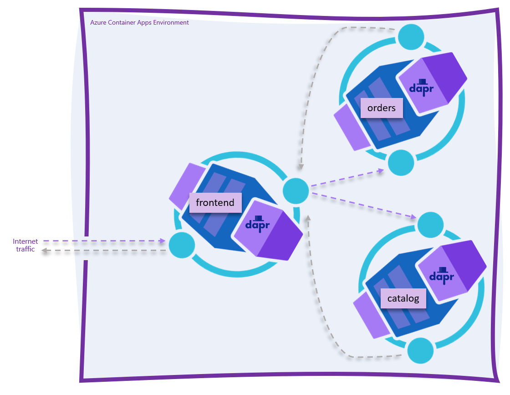

# ASP.NET Core Front-end + 2 Back-end APIs on Azure Container Apps with DAPR Service Discovery

This repository contains a simple scenario built to demonstrate how ASP.NET Core 6.0 can be used to build a cloud-native application hosted in Azure Container Apps. The repository consists of the following projects and folders:

* Catalog API - this is an ASP.NET minimal API project with one endpoint. 
* Orders API - this is an ASP.NET minimal API project with one endpoint. 
* UI - an ASP.NET Blazor Server app that calls out to both the Catalog and Orders API and renders their status. Rather than use hard-coded environment variables for API routing, [DAPR](https://dapr.io) is being used for service discovery.
* ```tye.yaml```  - this file defines microservices that can be run easily on local development machine using `tye run` command.
* ```deploy``` folder - this folder contains a series of [Azure Bicep](http://aka.ms/bicep) templates that can be used to create the application and deploy it.
* ```setup.ps1``` - this file is a one-stop way for you to deploy the app to your own Azure subscription so you can try the scenario. 

## Prerequisites

* .NET 6.0
* The Azure CLI
* An Azure subscription
* Docker
* [Dapr](https://docs.dapr.io/getting-started/install-dapr-cli/)
* [Tye](https://github.com/dotnet/tye/blob/main/docs/getting_started.md) (optional, recommended)
* PowerShell *(GitHub Actions will replace this prerequisite soon)*

To install the Azure Container Apps CLI commands until they are pre-installed in the Azure CLI, as documented in the [Azure Container Apps official docs](https://docs.microsoft.com/azure/container-apps/get-started?tabs=bash), execute this command:

```bash
az extension add --source https://workerappscliextension.blob.core.windows.net/azure-cli-extension/containerapp-0.2.0-py2.py3-none-any.whl
```

## Setup

1. Clone this repository.
2. From root of this repo, run on local machine with `tye run`.  Test url is http://localhost:5213.  Tye dasbboard is http://localhost:8000.  
3. View Zipkin observability and tracing on http://localhost:9411 
4. Sign in to your Azure subscription using the `az login` command.
5. If you have more than 1 Azure subscription, make sure you're targeting the *right* Azure subscription by using the `az account show` and `az account set -s <subscription-id>` commands.
6. From the root of this repo, run `./setup.ps1`. 

## Topology diagram

The resultant application is an Azure Container Environment-hosted set of containers - the `catalog` API, the `orders` API, and the `frontend` Razor Pages front-end.



Internet traffic should not be able to directly access either of the back-end APIs as each of these containers is marked as "internal ingress only" during the deployment phase. Internet traffic hitting the `frontend.<your app>.<your region>.azurecontainerapps.io` URL should be proxied to the `frontend` container, which in turn makes outbound calls to both the `catalog` and `orders` APIs within the Azure Container Apps Environment. Inbound and outbound HTTP traffic is handled by the DAPR sidecars in each container app. DAPR also handles routing to each of the back-end APIs, so no API routing is required.